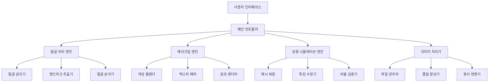

# 설계 문서

## 개요

자연스러운 메이크업 및 성형 시뮬레이션 시스템은 실시간 얼굴 분석, AI 기반 이미지 처리, 그리고 직관적인 사용자 인터페이스를 결합한 종합적인 뷰티 시뮬레이션 플랫폼입니다. 시스템은 모듈화된 아키텍처를 통해 확장성과 유지보수성을 보장합니다.

## 아키텍처

### 전체 시스템 아키텍처



### 레이어 구조

1. **프레젠테이션 레이어**: 사용자 인터페이스 및 상호작용
2. **비즈니스 로직 레이어**: 메이크업 및 성형 처리 로직
3. **데이터 처리 레이어**: 이미지 처리 및 얼굴 분석
4. **인프라 레이어**: 파일 시스템, 카메라 접근, GPU 처리

## 컴포넌트 및 인터페이스

### 1. 얼굴 처리 엔진 (FaceEngine)

**책임:**
- 실시간 얼굴 감지 및 추적
- 468개 3D 얼굴 랜드마크 추출
- 얼굴 영역 분할 및 분석

**주요 클래스:**
```python
class FaceEngine:
    def detect_face(self, image: np.ndarray) -> FaceDetectionResult
    def extract_landmarks(self, image: np.ndarray) -> List[Point3D]
    def analyze_face_structure(self, landmarks: List[Point3D]) -> FaceAnalysis
    def track_face(self, video_stream: VideoStream) -> Iterator[FaceFrame]

class FaceDetectionResult:
    bbox: BoundingBox
    confidence: float
    landmarks: List[Point3D]
    face_regions: Dict[str, Polygon]
```

### 2. 메이크업 엔진 (MakeupEngine)

**책임:**
- 다양한 메이크업 효과 적용
- 색상 블렌딩 및 텍스처 매핑
- 실시간 효과 렌더링

**주요 클래스:**
```python
class MakeupEngine:
    def apply_lipstick(self, image: np.ndarray, landmarks: List[Point3D], 
                      color: Color, intensity: float) -> np.ndarray
    def apply_eyeshadow(self, image: np.ndarray, landmarks: List[Point3D],
                       colors: List[Color], style: EyeshadowStyle) -> np.ndarray
    def apply_blush(self, image: np.ndarray, landmarks: List[Point3D],
                   color: Color, intensity: float) -> np.ndarray
    def apply_foundation(self, image: np.ndarray, skin_tone: Color) -> np.ndarray

class MakeupConfig:
    lipstick: LipstickConfig
    eyeshadow: EyeshadowConfig
    blush: BlushConfig
    foundation: FoundationConfig
    eyeliner: EyelinerConfig
```

### 3. 성형 시뮬레이션 엔진 (SurgeryEngine)

**책임:**
- 얼굴 특징 변형 시뮬레이션
- 자연스러운 비율 유지
- 실시간 워핑 처리

**주요 클래스:**
```python
class SurgeryEngine:
    def modify_nose(self, image: np.ndarray, landmarks: List[Point3D],
                   modification: NoseModification) -> np.ndarray
    def modify_eyes(self, image: np.ndarray, landmarks: List[Point3D],
                   modification: EyeModification) -> np.ndarray
    def modify_jawline(self, image: np.ndarray, landmarks: List[Point3D],
                      modification: JawlineModification) -> np.ndarray
    def validate_proportions(self, modified_landmarks: List[Point3D]) -> bool

class SurgeryConfig:
    nose: NoseConfig
    eyes: EyeConfig
    jawline: JawlineConfig
    cheekbones: CheekboneConfig
```

### 4. 이미지 처리기 (ImageProcessor)

**책임:**
- 고품질 이미지 저장
- 형식 변환 및 최적화
- 비교 이미지 생성

**주요 클래스:**
```python
class ImageProcessor:
    def save_result(self, image: np.ndarray, metadata: ImageMetadata) -> str
    def create_comparison(self, original: np.ndarray, 
                         modified: np.ndarray) -> np.ndarray
    def enhance_quality(self, image: np.ndarray) -> np.ndarray
    def convert_format(self, image: np.ndarray, format: ImageFormat) -> bytes
```

## 데이터 모델

### 얼굴 데이터 모델

```python
@dataclass
class Point3D:
    x: float
    y: float
    z: float

@dataclass
class FaceRegion:
    name: str
    points: List[Point3D]
    center: Point3D
    area: float

@dataclass
class FaceAnalysis:
    face_shape: FaceShape
    skin_tone: Color
    eye_shape: EyeShape
    nose_shape: NoseShape
    lip_shape: LipShape
    symmetry_score: float
```

### 메이크업 데이터 모델

```python
@dataclass
class Color:
    r: int
    g: int
    b: int
    a: int = 255

@dataclass
class MakeupStyle:
    name: str
    lipstick_color: Color
    eyeshadow_colors: List[Color]
    blush_color: Color
    intensity_levels: Dict[str, float]
```

### 성형 데이터 모델

```python
@dataclass
class FeatureModification:
    feature_type: FeatureType
    modification_vector: Vector3D
    intensity: float
    natural_limit: float

@dataclass
class SurgeryPreset:
    name: str
    modifications: List[FeatureModification]
    description: str
```

## 오류 처리

### 오류 계층 구조

```python
class BeautySimulationError(Exception):
    """기본 예외 클래스"""
    pass

class FaceDetectionError(BeautySimulationError):
    """얼굴 감지 실패"""
    pass

class InvalidImageError(BeautySimulationError):
    """잘못된 이미지 형식"""
    pass

class ProcessingTimeoutError(BeautySimulationError):
    """처리 시간 초과"""
    pass

class InsufficientResourceError(BeautySimulationError):
    """리소스 부족"""
    pass
```

### 오류 처리 전략

1. **Graceful Degradation**: 일부 기능 실패 시 다른 기능은 계속 동작
2. **Retry Mechanism**: 일시적 오류에 대한 재시도 로직
3. **Fallback Options**: 고급 기능 실패 시 기본 기능으로 대체
4. **User Feedback**: 명확한 오류 메시지와 해결 방법 제공

## 테스트 전략

### 단위 테스트

- 각 엔진의 개별 메서드 테스트
- 모의 객체를 사용한 독립적 테스트
- 경계값 및 예외 상황 테스트

### 통합 테스트

- 엔진 간 상호작용 테스트
- 실제 이미지를 사용한 end-to-end 테스트
- 성능 벤치마크 테스트

### 사용자 인터페이스 테스트

- 자동화된 UI 테스트
- 사용성 테스트
- 접근성 테스트

### 성능 테스트

```python
class PerformanceTest:
    def test_real_time_processing(self):
        """실시간 처리 성능 (30fps 목표)"""
        pass
    
    def test_memory_usage(self):
        """메모리 사용량 모니터링"""
        pass
    
    def test_gpu_utilization(self):
        """GPU 활용도 측정"""
        pass
```

### 품질 보증

- 다양한 얼굴 형태와 피부톤에 대한 테스트
- 조명 조건 변화에 대한 강건성 테스트
- 실시간 성능 요구사항 검증
- 자연스러움 평가를 위한 사용자 연구

## 기술 스택

### 핵심 라이브러리
- **OpenCV**: 이미지 처리 및 컴퓨터 비전
- **MediaPipe**: 얼굴 감지 및 랜드마크 추출
- **NumPy**: 수치 연산 및 배열 처리
- **Pillow**: 이미지 형식 처리
- **scikit-image**: 고급 이미지 처리

### UI 프레임워크
- **Streamlit**: 빠른 프로토타이핑 및 웹 인터페이스
- **OpenGL**: GPU 가속 렌더링
- **PyQt/Tkinter**: 데스크톱 애플리케이션 (선택사항)

### 성능 최적화
- **Numba**: JIT 컴파일을 통한 성능 향상
- **CuPy**: GPU 가속 배열 연산
- **Threading/Asyncio**: 비동기 처리

## 배포 및 확장성

### 배포 옵션
1. **웹 애플리케이션**: Streamlit 기반 브라우저 접근
2. **데스크톱 애플리케이션**: PyInstaller를 통한 실행 파일
3. **모바일 앱**: React Native 또는 Flutter 연동

### 확장성 고려사항
- 모듈화된 아키텍처로 새로운 효과 추가 용이
- 플러그인 시스템을 통한 서드파티 확장
- 클라우드 기반 처리를 위한 API 설계
- 다국어 지원을 위한 국제화 구조